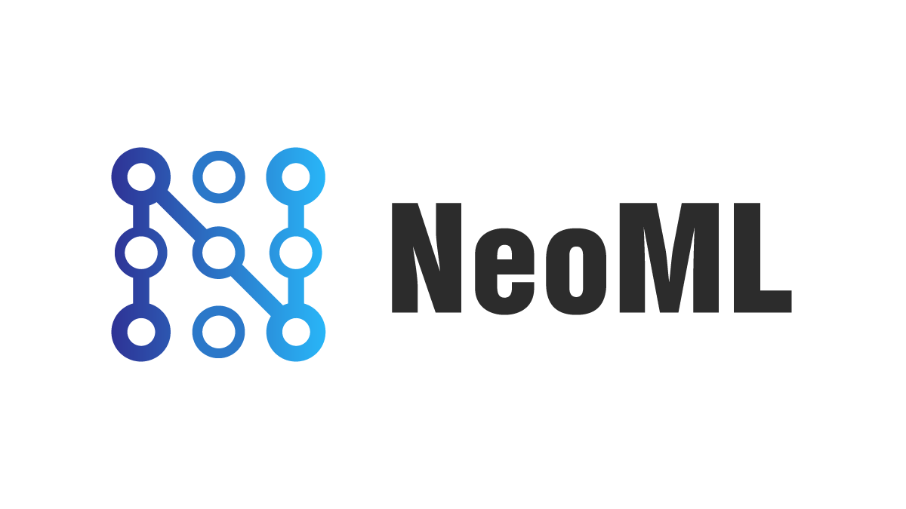

**NeoML** - это кросс платформенная библиотека машинного обучения, реализующая полный цикл разработки ML моделей. Библиотека основана на многолетнем опыте использования ML в компании ABBYY и проверена десятками успешных коммерческих проектов.

Основной фокус сделан на простом и эффективном использовании готовых моделей в том числе созданных другими фреймворками.

Библиотека предоставляет C++ интерфейс для обучения, а также дополнительно Java и ObjectiveC интерфейсы для применения моделей.

Используя библиотеку вы получаете следующие преимущества:
- обученные модели могут быть запущены на различных платформах и устройствах
- библиотека хорошо оптимизирована для работы на CPU и GPU и зачастую работает быстрее аналогов
- поддерживает модели созданные в других фреймворках поддерживающих ONNX
- позволяет обучать как нейросетевые так и традиционные модели машинного обучения.

## Содержание

<!-- TOC -->

- [Установка и сборка](#установка-и-сборка)
	- [Поддерживаемые платформы](#поддерживаемые-платформы)
	- [Third party](#third-party)
	- [Сборка полных C++ версий](#сборка-полных-c++-версий)
	- [Сборка inference Java и ObjectiveC версий](#сборка-inference-java-и-objectivec-версий)
- [Начало работы](#начало-работы)
- [Описание API](#описание-api)
	- [Общие принципы](#общие-принципы)
		- [Независимость от платформы](#независимость-от-платформы)
		- [Независимость вычислительных движков](#независимость-вычислительных-движков)
		- [Поддержка многопоточности](#поддержка-многопоточности)
		- [Поддержка ONNX](#поддержка-onnx)
		- [Собственный формат сериализации](#собственный-формат-сериализации)
		- [Поддержка GPU](#поддержка-gpu)
		- [FineObj](#fineobj)
	- [C++ интерфейс](#c++-интерфейс)
		- [Библиотека алгоритмов NeoML](#библиотека-алгоритмов-neoml)
		- [Вычислительный движок NeoMathEngine](#вычислительный-движок-neomathengine)	
	- [Java интерфейс](#java-интерфейс)
	- [ObjectiveC интерфейс](#objectivec-интерфейс)
- [Лицензия](#лицензия)

<!-- /TOC -->

## Установка и сборка

### Поддерживаемые платформы
На текущий момент полная С++ версия библиотеки была протестирована на следующих платформах:

|Целевая операционная система|Компилятор|Архитектура|
|----------|----------|------------------------------|
|Windows 7+ (CPU и GPU)|MSVC 2015+|x86, x86_64|
|Ubuntu 14+ (CPU) |gcc 5.4+|x86_64|
|MacOS 10.11+|Apple clang 11+|x86_64|
|iOS 11+ (CPU, GPU)|Apple clang 11+|arm64-v8a, x86_64|
|Android 5.0+ (CPU), Android 7.0+ (GPU)|clang 7+|armeabi-v7a, arm64-v8a, x86, x86_64|

Версии для прямого прохода нейронных сетей на java и objectiveC:
|Целевая операционная система|Компилятор|Архитектура|
|----------|----------|------------------------------|
|iOS 11+ (CPU, GPU)|Apple clang 11+|arm64-v8a, x86_64|
|Android 5.0+ (CPU), Android 7.0+ (GPU)|clang 7+|armeabi-v7a, arm64-v8a, x86, x86_64|

### Third party

Для сборки вам понадобится [CMake](https://cmake.org/download/) (версии не ниже 3.11).

Для максимальной производительности на CPU под Windows, Linux и MacOS мы используем [Intel MKL](https://software.intel.com/en-us/mkl)

Также опционально для вычислений на GPU под Windows можно использовать [CUDA](https://developer.nvidia.com/cuda-downloads) (версии 10.2), а для Android [Vulkan](https://vulkan.lunarg.com/sdk/home) (версии не ниже 1.1.130).

### Сборка полных C++ версий

Сборка полных С++ версий на различных платформах описана [здесь](Installation/cpp.md).

### Сборка inference Java и ObjectiveC версий

Сборка inference Java и ObjectiveC версий на различных платформах описана [здесь](Installation/inference.md).

## Начало работы

Посмотреть готовые примеры и быстрее начать работу можно с помощью обучающих материалов:

- [Пример создания простой сети](Tutorial/SimpleNet.md).
- [Классификация с использованием градиентного бустинга](Tutorial/News20Classification.md).
- [Кластеризация данных](Tutorial/IrisClustering.md).

## Описание API

Для более глубокого знакомства с библиотекой необходимо ознакомиться с основными принципами и интерфейсом библиотеки.

### Общие принципы

В основу библиотеки заложены следующие принципы:

#### Независимость от платформы

Пользовательский интерфейс библиотеки алгоритмов полностью изолирован от низкоуровневой реализации вычислительных функций. 

Пользователю достаточно лишь в начале работы указать, какую реализацию вычислительного движка надо использовать, притом можно воспользоваться автоматическим выбором рекомендованного движка для текущей конфигурации. Весь код, работающий с нужными вам алгоритмами, будет выглядеть одинаково при любом выборе движка.

#### Независимость вычислительных движков

Каждая сеть использует только одну реализацию вычислительного движка; все её слои должны быть созданы над этим же движком. Если выбран движок над GPU, то все вычисления будут выполняться только на нём. Т.е. невозможна ситуация, когда внутри одного алгоритма, «легкие» функции (например, сложение векторов) выполняются на CPU, а «тяжелые» (например, умножение матриц) - на GPU. Это необходимо для того, чтобы избежать лишней синхронизации и копирования данных между CPU и GPU.

#### Поддержка многопоточности

Интерфейс вычислительного движка [`IMathEngine`](API/NN/MathEngine.md) потокобезопасен: один и тот же вычислительный движок может быть использован в разных сетях с разных потоков.

При этом стоит учитывать возможные накладные расходы на синхронизацию.

А вот реализация нейросети [`CDnn`](API/NN/Dnn.md) не является потокобезопасной. Сеть может использоваться только в одном потоке.

#### Поддержка ONNX

Модели созданные другими фреймворками могут быть использованы в NeoML благодаря поддержки формата [ONNX](https://onnx.ai/).

#### Собственный формат сериализации

Для сохранения и загрузки моделей библиотека использует собственный бинарный формат сериализации (классы `CArchive`, `CArchiveFile`). 

#### Поддержка GPU

Не секрет, что использование GPU часто позволяет получить существенный выигрыш в производительности при выполнении математических операций. **NeoML** активно использует возможности GPU при обучении и исполнении моделей.
Данная возможность является опциональной и зависит от наличия необходимого аппаратного и программного обеспечения. Библиотека предъявляет следующие требования для использования GPU:
- Windows: NVIDIA® GPU card с поддержкой CUDA® 10.2.
- iOS: Apple GPU A7+.
- Android: устройства с поддержкой Vulkan 1.0.
- Linux/MacOS: вычисления на GPU пока не поддержаны. 

#### FineObj

Библиотека **NeoML** - это библиотека, использующаяся во внутренней инфраструктуре компании ABBYY. По различным причинам, в компании используется собственный фреймворк для написания кроссплатформенных приложений, называемый FineObj.

В связи с этим открытая версия библиотеки использует некоторые примитивы из этого фреймворка, см. [общие классы](API/Common/README.md).

### C++ интерфейс 

**NeoML** состоит из двух C++ библиотек:

#### Библиотека алгоритмов NeoML

Библиотека представляет собой набор C++ объектов, реализующих высокоуровневую логику различных алгоритмов. Этот набор можно разделить на следующие части:

- [Нейронные сети](API/NN/README.md)
- [Алгоритмы решения задачи классификации и регрессии](API/ClassificationAndRegression/README.md)
- [Алгоритмы кластеризации](API/Clustering/README.md)
- [Вспомогательные алгоритмы](API/Algorithms/README.md)

#### Вычислительный движок NeoMathEngine

Вычислительный движок представляет собой отдельный модуль, реализующий низкоуровневые вычислительные функции, используемые внутри библиотеки алгоритмов. Для вызова пользователем эти функции также доступны, но обычно это вам не потребуется.

Данный модуль имеет несколько реализаций для различных платформ; в частности, при наличии графического вычислительного устройства (GPU) можно вычислять на нём.

Интерфейс вычислительного движка представляет собой набор C++ интерфейсов и описан [здесь](API/NN/MathEngine.md)

### Java интерфейс

Для удобства использования библиотеки в языка Java и Kotlin создан [java интерфейс](../en/Wrappers/Java.md), который предоставляет возможность запуска уже обученной ранее нейронной сети.

### ObjectiveC интерфейс

Для удобства использования библиотеки в языка Swift и ObjectiveC создан [objectiveC интерфейс](../en/Wrappers/ObjectiveC.md), который предоставляет возможность запуска уже обученной ранее нейронной сети.

## Лицензия
Copyright © 2016-2020 ABBYY Production LLC. Licensed under the Apache License, Version 2.0. Смотрите файл [лицензии](../../../LICENSE).
